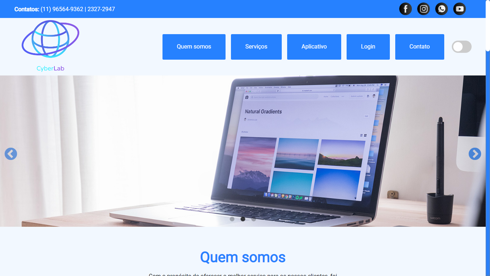

<h1 align="center">CyberLab</h1> 

## :page_with_curl: Descrição:

Este é um projeto de website institucional que tem como objetivo apresentar a empresa CyberLab, seus serviços, seu app, e mostrar os agendamentos do usuário. 
Este website faz parte do projeto de uma empresa fictícia chamada CyberLab, este projeto possui um [app Xamarin](#app), [programa C#](#programa) e um Website, logo seu banco de dados é integrado com ambas aplicações.

## :wrench: Funcionalidades:
* Tema escuro
* Banner Slider
* Animações
* Login de usuário
* Animação de link ancora
* Botão de retornar ao topo
* Iframe pop-up

## :triangular_ruler: Layout:

<h1 align="center">

</h1>

## :cd: Instalação:  
Para que o php funcione use o banco de dados que está na pasta <i>site-cyberlab/banco</i> no seu servidor e instale as outras aplicações integradas. 
O cadastro e agendamento de usuário é efetuado pelo Programa e o App:

### Aplicações integradas:  

 

## :boy: Desenvolvedores: 

## :scroll: Licença:

## :pencil: Status do projeto:
Finalizado.
